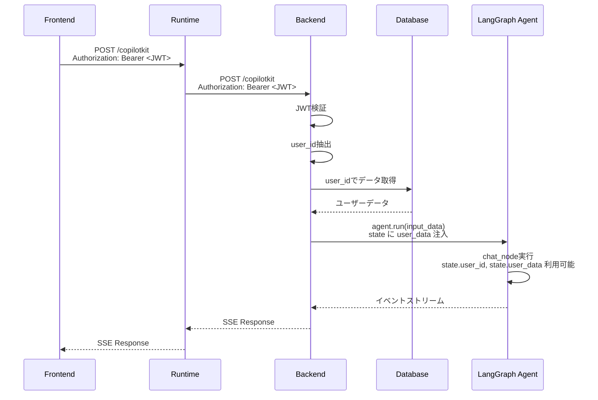

# JWT認証によるLangGraph State注入 設計ドキュメント

## 概要

BackendにJWT認証を導入し、JWTから抽出した`user_id`をキーにして永続化データを取得、LangGraphのAgentStateに注入する。

## 現状の課題

`add_langgraph_fastapi_endpoint`は拡張ポイントがなく、`request`オブジェクトから認証ヘッダーを取得してagentに渡す方法がない。

## 解決策

`add_langgraph_fastapi_endpoint`を使用せず、自前でFastAPIエンドポイントを実装する。

---

## アーキテクチャ

### システム構成

```
┌─────────────┐     ┌─────────────┐     ┌─────────────┐
│  Frontend   │────▶│   Runtime   │────▶│   Backend   │
│  (React)    │     │  (Express)  │     │  (FastAPI)  │
│  :5173      │     │  :4000      │     │  :8000      │
└─────────────┘     └─────────────┘     └─────────────┘
      │                   │                    │
      │ Authorization:    │ Authorization:     │ JWT検証
      │ Bearer <token>    │ Bearer <token>     │ → user_id抽出
      └───────────────────┴────────────────────┘
```

### シーケンス図



---

## 実装計画

### 1. Backend: 自前エンドポイント作成

**ファイル**: `backend/src/backend/main.py`

```python
from fastapi import Depends, Request
from fastapi.security import HTTPBearer
from fastapi.responses import StreamingResponse
from ag_ui.core.types import RunAgentInput
from ag_ui.encoder import EventEncoder

security = HTTPBearer()

@app.post("/copilotkit")
async def copilotkit_endpoint(
    input_data: RunAgentInput,
    request: Request,
    credentials = Depends(security)
):
    # 1. JWT検証 & user_id抽出
    user_id = verify_jwt(credentials.credentials)

    # 2. user_idでDBからデータ取得
    user_data = await get_user_data(user_id)

    # 3. input_data.forwarded_propsにuser情報を注入
    input_data.forwarded_props = {
        **(input_data.forwarded_props or {}),
        "user_id": user_id,
        "user_data": user_data,
    }

    # 4. agentを実行
    accept_header = request.headers.get("accept")
    encoder = EventEncoder(accept=accept_header)

    async def event_generator():
        async for event in agent.run(input_data):
            yield encoder.encode(event)

    return StreamingResponse(
        event_generator(),
        media_type=encoder.get_content_type()
    )
```

### 2. Backend: AgentStateにuser_idフィールド追加

**ファイル**: `backend/src/backend/agent.py`

```python
class AgentState(CopilotKitState):
    tools: list[Any]
    user_id: str | None = None
    user_data: dict | None = None
```

### 3. Backend: JWT検証ユーティリティ

**ファイル**: `backend/src/backend/auth.py` (新規作成)

```python
import jwt
from fastapi import HTTPException

def verify_jwt(token: str) -> str:
    try:
        payload = jwt.decode(token, settings.jwt_secret, algorithms=["HS256"])
        return payload["user_id"]
    except jwt.ExpiredSignatureError:
        raise HTTPException(status_code=401, detail="Token expired")
    except jwt.InvalidTokenError:
        raise HTTPException(status_code=401, detail="Invalid token")
```

### 4. Frontend: Authorizationヘッダー設定

**ファイル**: `frontend/src/App.tsx`

```tsx
<CopilotKit
  runtimeUrl={import.meta.env.VITE_COPILOT_RUNTIME_URL}
  agent="sample_agent"
  headers={{
    "Authorization": `Bearer ${accessToken}`
  }}
>
```

### 5. Runtime: ヘッダー転送確認

Express側で`Authorization`ヘッダーがBackendに転送されることを確認。
`LangGraphHttpAgent`はデフォルトでヘッダーを転送する。

---

## 修正対象ファイル

| ファイル | 変更内容 |
|---------|---------|
| `backend/src/backend/main.py` | 自前エンドポイント実装、`add_langgraph_fastapi_endpoint`削除 |
| `backend/src/backend/agent.py` | `AgentState`に`user_id`, `user_data`フィールド追加 |
| `backend/src/backend/auth.py` | JWT検証ユーティリティ（新規作成） |
| `backend/src/backend/config.py` | `jwt_secret`設定追加 |
| `backend/.env.example` | `JWT_SECRET`追加 |
| `frontend/src/App.tsx` | `headers`プロパティでJWT送信 |

---

## 依存パッケージ

### Backend
```bash
uv add pyjwt
```

---

## 環境変数

### backend/.env
```
JWT_SECRET=your-jwt-secret-key
```

---

## 決定事項

| 項目 | 決定 |
|------|------|
| JWT発行 | モック（開発用に固定トークン使用） |
| データベース | SQLite |
| 注入データ | ユーザープロファイル（名前、設定、好み等） |

---

## 追加実装

### 6. SQLiteセットアップ

**ファイル**: `backend/src/backend/database.py` (新規作成)

```python
import sqlite3
from pathlib import Path

DB_PATH = Path(__file__).parent.parent.parent.parent / "data" / "app.db"

def get_db():
    DB_PATH.parent.mkdir(exist_ok=True)
    conn = sqlite3.connect(DB_PATH)
    conn.row_factory = sqlite3.Row
    return conn

def init_db():
    conn = get_db()
    conn.execute("""
        CREATE TABLE IF NOT EXISTS users (
            id TEXT PRIMARY KEY,
            name TEXT,
            preferences TEXT
        )
    """)
    # サンプルデータ
    conn.execute("""
        INSERT OR IGNORE INTO users (id, name, preferences)
        VALUES ('user_123', 'テストユーザー', '{"theme": "dark", "language": "ja"}')
    """)
    conn.commit()
    conn.close()
```

### 7. ユーザーデータ取得

**ファイル**: `backend/src/backend/services.py` (新規作成)

```python
import json
from .database import get_db

async def get_user_profile(user_id: str) -> dict | None:
    conn = get_db()
    row = conn.execute(
        "SELECT * FROM users WHERE id = ?", (user_id,)
    ).fetchone()
    conn.close()

    if row:
        return {
            "id": row["id"],
            "name": row["name"],
            "preferences": json.loads(row["preferences"] or "{}"),
        }
    return None
```

### 8. モックJWT生成スクリプト

**ファイル**: `backend/scripts/generate_token.py` (新規作成)

```python
import jwt
from datetime import datetime, timedelta

SECRET = "dev-secret-key"
payload = {
    "user_id": "user_123",
    "exp": datetime.utcnow() + timedelta(days=30)
}
token = jwt.encode(payload, SECRET, algorithm="HS256")
print(f"Bearer {token}")
```

---

## 修正対象ファイル（更新版）

| ファイル | 変更内容 |
|---------|---------|
| `backend/src/backend/main.py` | 自前エンドポイント実装、`add_langgraph_fastapi_endpoint`削除 |
| `backend/src/backend/agent.py` | `AgentState`に`user_id`, `user_profile`フィールド追加 |
| `backend/src/backend/auth.py` | JWT検証ユーティリティ（新規作成） |
| `backend/src/backend/database.py` | SQLiteセットアップ（新規作成） |
| `backend/src/backend/services.py` | ユーザーデータ取得（新規作成） |
| `backend/src/backend/config.py` | `jwt_secret`設定追加 |
| `backend/.env.example` | `JWT_SECRET`追加 |
| `backend/scripts/generate_token.py` | モックJWT生成（新規作成） |
| `frontend/src/App.tsx` | `headers`プロパティでJWT送信 |

---

## 依存パッケージ（更新版）

### Backend
```bash
uv add pyjwt
# SQLiteはPython標準ライブラリなので追加不要
```
